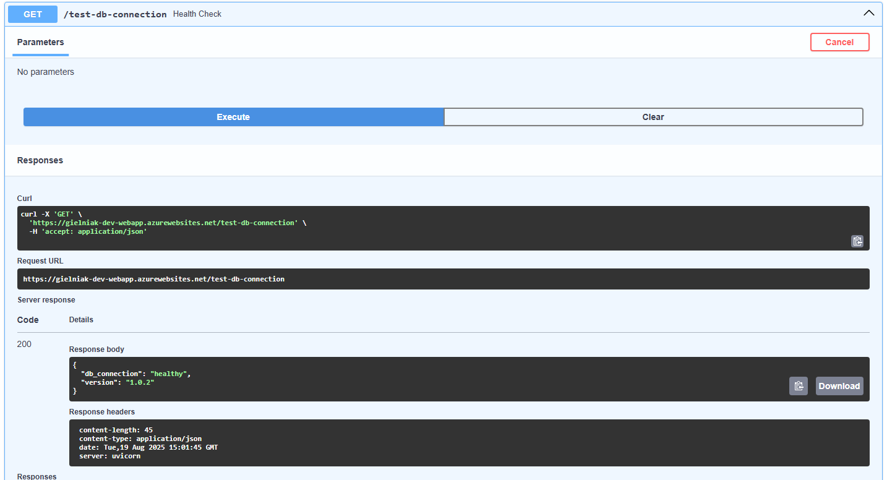

# Introduction

This file describes the project that has as a goal the following

1. Deploy an Application on Azure (Use Free Account)

- Create an Azure App Service that connects to a MySQL or PostgreSQL database using a private endpoint.

- The application should have a basic UI that interacts with the database (e.g., storing and retrieving data).

- Provide a simple web application (Node.js, Python, or any preferred language).

- Implement a test that verifies the database connection.

- All these Azure Resources should be created thought Infrastructure as Code (Terraform)

 

3. Containerization

- Package the application into a Docker image.

- Provide a Dockerfile to build and run the application locally.

- Run the application in a Docker container to ensure functionality.

 

4. Infrastructure as Code (Terraform)

- Write a Terraform script that allows the infrastructure to be deployed in different environments (e.g., dev, staging, production).

- The script should provision:

    - Azure App Service

    - Azure Database (MySQL/PostgreSQL)

    - Vnet, Subnets

    - Private Endpoint

- Ensure variables can be used for different configurations.

 

5. CI/CD Pipeline (Use Free Account)

Create a GitLab CI/CD or GitHub Actions pipeline to automate the following:

- Build and push the Docker image to a container registry (Azure Container Registry or Docker Hub).

- Deploy the Terraform infrastructure.

- Deploy the application to Azure App Service.

- Run some simple tests to verify the application.

# Assumptions

My assumptions for the project are:

- PostgreSQL database is a managed PostgreSQL instance (Flexible Server)
- Basic UI that interacts with the database is Swagger
- Application is a Python, FastAPI application
- Storage Account for tfstate and Azure Container Registry are shared resources across dev, staging and prod and they are deployed manually upfront
- Storage Account and Container registry are deployed with public access enabled for simplification
- For simplicity the Service Principal used in Github Action is using Secret instead of a Federated Credential and has a Contributor role over the subscription scope and Role Based Access Administrator

# Application (backend folder)

The 'backend' folder of this repository contains the Python application written with help of FastAPI that connects to PostgreSQL with SQLAlchemy.
In the main.py file are defined api endpoints for creating, updating, deleting and retrieving records from the database. That file also contains a 'test-db-connection' endpoint that checks if the database is reachable. For the demo purposes this endpoint returns also a hardcoded version (to be able to easily showcase the automatic deployment of changes).

The main.py (api) communicates with the data_service defined in the servies.py file which contains methods to 
- be able to inject the data service into api
- initialize db on a new database server
- it exposes Business logic (there isn't much) and communicates with data_repo implemented in repository.py which serves as data access layer
- repository.py talks with postgresql via SQLAlchemy Session
- by accessing the /docs endpoint we are able to access the Swagger UI to interact with the database objects

The above is supposed to satisfy the following requirements:

1. Deploy an Application on Azure (Use Free Account)

- The application should have a basic UI that interacts with the database (e.g., storing and retrieving data).

- Provide a simple web application (Node.js, Python, or any preferred language).

- Implement a test that verifies the database connection.


# Containerization (backend folder - Dockerfile)

The Dockerfile is based on a lightweight python container. It's very simple and all it does is copying project files to the appropriate container directory and running uvicorn command as a startup command.

In order to build the image locally you need to make sure you installed docker

Check 

```bash

docker -version

```

If the command isn't recognized run the following script


```bash
sudo apt-get update
sudo apt-get install -y ca-certificates curl gnupg
sudo install -m 0755 -d /etc/apt/keyrings
curl -fsSL https://download.docker.com/linux/ubuntu/gpg | sudo gpg --dearmor -o /etc/apt/keyrings/docker.gpg
echo \
  "deb [arch=\"$(dpkg --print-architecture)\" signed-by=/etc/apt/keyrings/docker.gpg] https://download.docker.com/linux/ubuntu \
  $(lsb_release -cs) stable" | \
  sudo tee /etc/apt/sources.list.d/docker.list > /dev/null
sudo apt-get update
sudo apt-get install -y docker-ce docker-ce-cli containerd.io docker-buildx-plugin docker-compose-plugin
```
After that you can build the application. You need to be in the backend folder of the repository and run the following command

```bash
docker build -t fastapi-test:latest .
```

3. Test if the image is available

```bash
docker image list
```
you should see something like this

```
REPOSITORY     TAG       IMAGE ID       CREATED          SIZE
fastapi-test   latest    1a90358b749b   26 seconds ago   180MB
```

Now you are able to run the docker container and pass the DATABASE_URL environment variable. 

Make sure that the database connection string has the following format

```
postgresql+asyncpg://<postgres-user>:<postgres-password>@<database-url>/<database-name>
```

The database needs to pre-exist with proper schema.

It needs to have a table called 'records' with the following columns
- id (uuid)
- name (text)
- value (text)
- created_at (timestap with timezone)
- updated__at (timestamp with timezone)

NOTE: The application ensures the db and tables are created if not existing - so you don't have to worry

```bash

docker run -e DATABASE_URL='db-url' -p 8000:8000 fastapi-test:latest
```

The container will have port 8000 mapped to your local port 8000 so you can test the application by calling the 'test-database-connection' endpoint

```bash
curl -X 'GET' \
  'http://localhost:8000/test-db-connection' \
  -H 'accept: application/json'

```

or open http://localhost:8000/docs - to interact with the API via Swagger


The above documentation is supposed to satisfy the following requirements:


- Package the application into a Docker image.

- Provide a Dockerfile to build and run the application locally.

- Run the application in a Docker container to ensure functionality.


# IaaC (terraform folder)

The terraform folder consists of the Infrastructure Definition files in the Terraform format. (However I used an open source fork of Terraform - open tofu, but the only difference is the command 'tofu' instead of 'terraform').

The root of this folder contains the following files

- main.tf
- outputs.tf
- providers.tf
- variables.tf
- versions.tf

The resources deployed by the main terraform file are defined in the files in the /modules folder. These are

- database
- identity
- networking
- web-app

Also - environment specific variables and references to different tfstate files are set up in the folders in the 'environments' directory.


In order to deploy an application to the specific Azure environment make sure you (or the deployment agent) are authenticated to Azure with e.g 'az login'

Then run the following script

```bash
ENV='dev' # or staging or prod
REGISTRY_NAME='gielniakcontainerregistry.azurecr.io'
IMAGE_NAME='fastapi-test'
IMAGE_TAG='latest'

cd terraform # assuming you're at the root of the repository

tofu init -backend-config="./environments/${ENV}/backend.tfbackend" -input=false
tofu apply -var-file="./environments/${ENV}/terraform.tfvars" -auto-approve -input=false \
  -var "docker_image=${REGISTRY_NAME}/${IMAGE_NAME}" \
  -var "docker_tag=${IMAGE_TAG}"

```

If you want to create a new environment, you need to create a new folder in the environments directory and provide backend and variable files.


This part is supposed to satisfy the following requirements.

1. Deploy an Application on Azure (Use Free Account)
- Create an Azure App Service that connects to a MySQL or PostgreSQL database using a private endpoint.
- All these Azure Resources should be created thought Infrastructure as Code (Terraform)

4. Infrastructure as Code (Terraform)

- Write a Terraform script that allows the infrastructure to be deployed in different environments (e.g., dev, staging, production).
- The script should provision:
    - Azure App Service
    - Azure Database (MySQL/PostgreSQL)
    - Vnet, Subnets
    - Private Endpoint
- Ensure variables can be used for different configurations.


# CI CD Pipeline

In the .github/workflows directory there is a GitHub Actions pipeline that consists of:
- The main file: 'deploy.yaml' - triggered on push to master branch - its role is to build the docker image and push it to the container registry and then call reusable workflow with deployment template.
- deployment-template.yaml is a resuable workflow created to avoid duplication of the code while deploying to multiple environments. Its role is to use the generated in the previous step docker tag and apply it to the App Service along with any other changes to the infrastructure, using OpenTofu

- The script in .github/workflows/scripts (test.py) is called at the end of each delpoyment stage to verify the application is running. The test consists of simple API calls.

This part is supposed to satisfy the following requirement

5. CI/CD Pipeline (Use Free Account)

Create a GitLab CI/CD or GitHub Actions pipeline to automate the following:

- Build and push the Docker image to a container registry (Azure Container Registry or Docker Hub).
- Deploy the Terraform infrastructure.
- Deploy the application to Azure App Service.
- Run some simple tests to verify the application.


# DEMO

Situation: You are browsing the current application in the version 1.0.2



You just introduced a major change and want to upgrade to a newer version - 2.0.0

